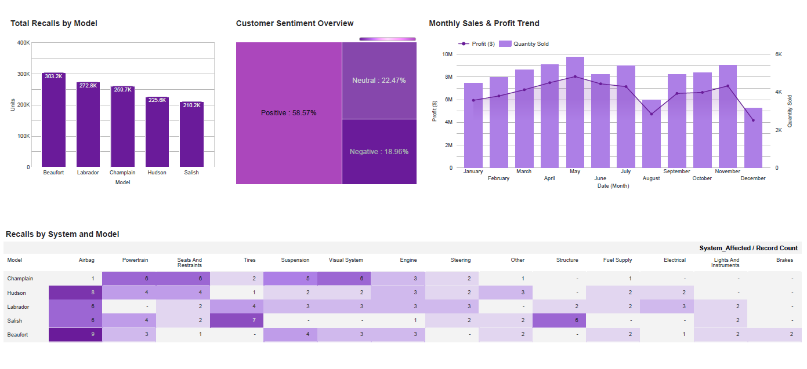

# 🚗 Automotive Sales & Service BI Analytics  
Executive Dashboard Suite | Cognos & Looker Studio  


## 📌 Project Overview

This project delivers executive-level BI dashboards designed to evaluate:

- Sales performance  
- Profit concentration  
- Dealer efficiency  
- Product quality risks  
- Customer sentiment trends  

The solution transforms structured operational datasets into strategic, decision-ready insights for management.  
The dashboards simulate real-world executive reporting environments and strategic performance monitoring scenarios.

Implemented in:

- IBM Cognos Analytics  
- Google Looker Studio  

The analytical logic was consistently replicated across both platforms to demonstrate tool-agnostic BI architecture.

---
## 📷 Dashboard Preview

### 🚘 Sales Performance Dashboard  

High-level executive overview of profitability and sales distribution.


---

### 🛠 Quality & Risk Dashboard  

Product quality exposure, recall clustering, and sentiment distribution.



---

## 📊 Executive KPIs

- **$78.4M Total Profit**
- **58,118 Units Sold**
- **19.37 Avg Units per Dealer**

All metrics were calculated within the BI layer using aggregation logic (SUM, AVG) and categorical segmentation across models, dealers, and systems.

---

## 🔎 Key Business Insights

### Profit Concentration

- Revenue is heavily concentrated among a limited group of dealers.
- A clear performance gap exists between top and underperforming dealers.

**Implication:** Structural imbalance within the dealer network.  
**Action:** Dealer benchmarking, KPI normalization, and regional optimization.

---

### Product Portfolio Dependence

- A small number of vehicle models generate the majority of total sales volume.

**Implication:** Portfolio concentration risk and reduced diversification.  
**Action:** Targeted product strategy and balanced marketing allocation.

---

### Seasonality

- Peak performance in May  
- Decline in August  
- Recovery toward Q4  

**Implication:** Revenue volatility and uneven operational load.  
**Action:** Seasonal demand planning and promotional alignment.

---

## 🛠 Quality & Risk Analytics

### Recall Concentration

- Certain vehicle models demonstrate elevated recall volumes.

**Risk:** Financial exposure and potential reputational impact.  
**Action:** Root Cause Analysis (RCA) and strengthened quality control procedures.

---

### Defect Clustering

Heatmap-based analysis identified recurring issues in:

- Airbag systems  
- Powertrain components  
- Structural elements  

**Implication:** Possible systemic manufacturing or supplier-related risks.

---

### Customer Sentiment

- 58.57% Positive  
- 22.47% Neutral  
- 18.96% Negative  

**Observation:** Nearly 20% negative sentiment may correlate with recall clustering and quality concerns.

---

## 🛠 Technical Highlights

- KPI architecture design within BI layer  
- Dual-axis trend modeling (Profit & Quantity)  
- Heatmap-based risk clustering  
- Categorical segmentation across business dimensions  
- Cross-platform BI implementation  
- Executive-focused dashboard layout and hierarchy  

---

## 📂 Project Structure
```
automotive-sales-bi/
│
├── data/                         → Structured source datasets for sales, recall, and sentiment analysis
│   ├── AU_Sales_By_Model.csv  
│   ├── AU_Car_Recalls.csv  
│   └── AU_Sentiment.csv              
│
├── cognos/                       → Executive dashboards built in IBM Cognos Analytics
│   ├── Sales_Dashboard.pdf  
│   └── Service_Dashboard.pdf         
│
├── google_looker/                → Cross-platform dashboard replication in Google Looker Studio
│   ├── Sales_Dashboard.pdf  
│   └── Service_Dashboard.pdf         
│
├── images/                       → Dashboard preview screenshots for README presentation
│   ├── cognos_sales_dashboard.png
│   ├── cognos_service_dashboard.png
│   ├── looker_sales_dashboard.png
│   └── looker_service_dashboard.png
│
└── README.md                     → Project documentation, business insights, and technical overview
```

---

## 🚀 Business Value

This project demonstrates applied BI capability in:

- Identifying structural profit imbalances  
- Detecting product quality risk clusters  
- Translating operational data into executive decision support  
- Delivering consistent, platform-agnostic BI solutions  

Designed to bridge operational data and strategic decision-making. 

---

## 👩‍💻 Author

**Palina Krasiuk**  
Cloud Data Engineering & Business Intelligence  
GitHub Portfolio
